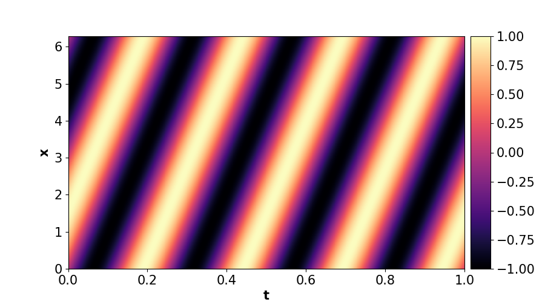
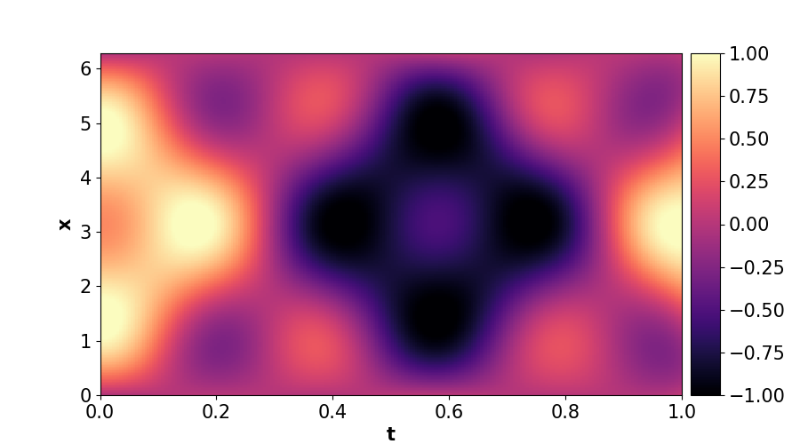

<table>
  <tr>
    <td></td>
    <td></td>
  </tr>
</table>


# PINNBench
PINNBench offers a platform to evaluate various architectures and methods for data-free PINN 1D designs, supporting an expanding set of PDE equations.

## Installing 
After cloning the project, follow these steps to install all dependencies:

Install Poetry by running:

`pip install poetry`

Build the project with:

`poetry build`

## Running the code


To run the code, execute the main.py file, which contains all the controlling parameters.


To reproduce the results from the bachelor thesis, use the following configurations:

```PINN = PINN_types.PINN_MLP.PINN(
    input_dim       = 2,                                                             
    output_dim      = 1,                                                              
    N_hidden        = 4,                                                               
    width_layer     = 200,                                                            
    domains         = [2*torch.pi,1],                                                          
    PDE_funct       = PINN_utils.Equations.PDE_equations.PDE_convection,                    
    Boundary_funct  = PINN_utils.Equations.Boundary_conditions.BC_equal,              
    Init_cond_funct = PINN_utils.Equations.Initial_conditions.IC_funct,              
    mapping         = None,                                                           
    act             = "wavelet"                                                          
)
```

As for configuring the main class,
```
main = Main(model = PINN.to(device),                  
                 epoch = 200000,                          
                 alpha_lr = 0.90,                     
                 lr_init = 1e-3,                      
                 min_lr  = 1e-9,                      
                 lr_freq = 5000,                     
                 weight_balance_freq = 2500,          
                 weight_balance     = "NTK",        
                 optimizer          = "Adam",         
                 training_scheme    = "classic",      
                 sampler_type       = "dynamic",       
                 sampler_domain     = [2*torch.pi,1], 
                 log  =True,                          
                 PDE_coefs = [90],                     
                 alpha = 0.9,                           
                 epsilon = 6e-6,                      
                 gradnorm_coefs=[0.5, 1000, 1e-4]     
            )
```


